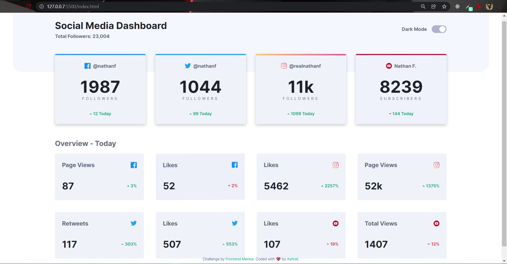
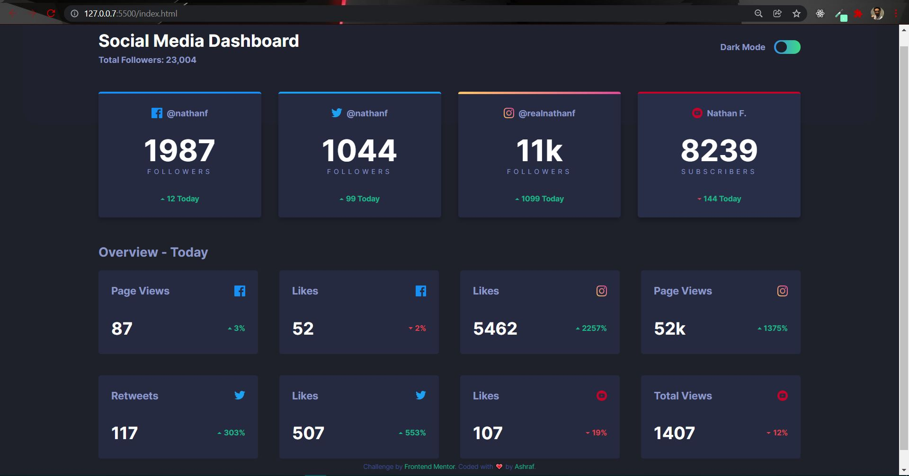

## Table of contents

- [Overview](#overview)
  - [The challenge](#the-challenge)
  - [Screenshot](#screenshot)
  - [Links](#links)
- [My process](#my-process)
  - [Built with](#built-with)
  - [Useful resources](#useful-resources)
- [Author](#Author)

## Overview

Social Media Dashboard with Theme Switcher.

### The challenge

Users should be able to:

- View the optimal layout for the site depending on their device's screen size.
- Switch between Light and Dark Theme.

### Screenshot

### Links

- Solution URL: [Solution](https://github.com/Ashraf-7/Social-Media-Dashboard)
- Live Site URL: [Go Live](https://ashraf-7.github.io/Social-Media-Dashboard/)

## My process

### Built with

- Semantic HTML5 markup
- CSS custom properties
- Flexbox
- Grid
- JavaScript (ES6)

### Useful resources

- [MDN](https://developer.mozilla.org/en-US/docs/Web/CSS) - This is an amazing and helpful website to understand CSS. I'd recommend it to anyone still learning this concept.
- [W3school](https://www.w3schools.com/css/default.asp) - This helpful website simplified the subjects.

## Author

- Frontend Mentor - [@Ashraf-7](https://www.frontendmentor.io/profile/Ashraf-7)
- LinkedIn - [@ashraf-7](https://www.linkedin.com/in/ashraf-awad-a27023b4/)
- CodePen - [@ashraf-7](https://codepen.io/ashraf-7)
